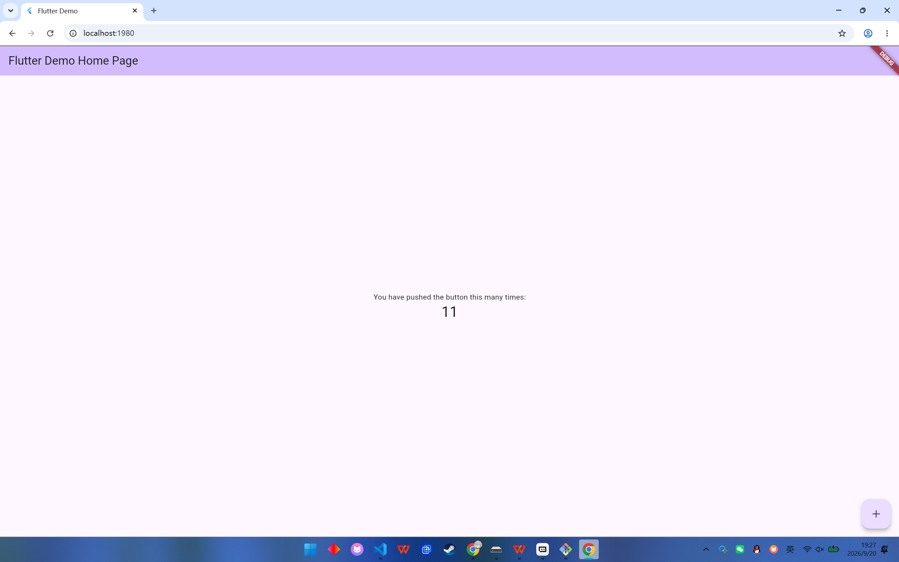
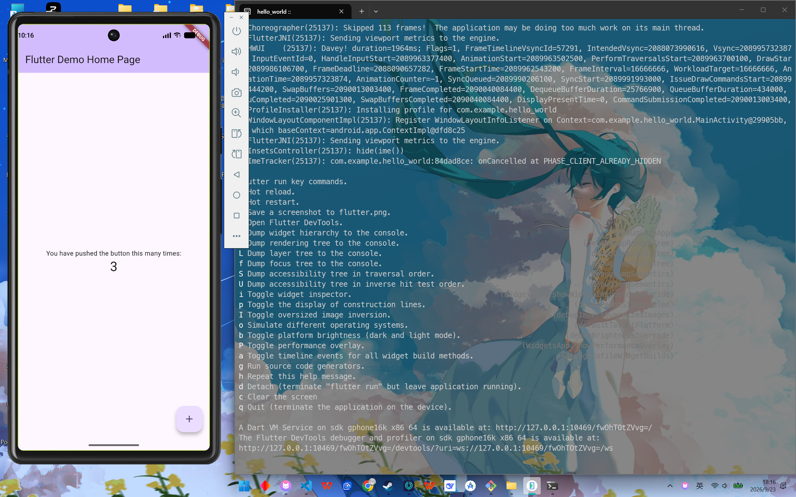

# hello_world

Flutter 第一个应用，支持在 Web 端和 Android 模拟器运行。

## 项目简介

本项目使用 `flutter create hello_world` 创建，入口文件为 `lib/main.dart`，根组件为 `MyApp`，通过 `runApp(const MyApp())` 挂载到屏幕。

## 环境要求

- Flutter SDK
- Chrome 浏览器
- Android Studio + Android 模拟器
- Git

建议先执行：

```bash
flutter doctor
```

确保开发环境正常。

## 运行方式

### Web 端运行

在项目根目录执行：

```bash
flutter run -d chrome
```

浏览器会自动打开，看到 Flutter 计数器示例即表示运行成功。

### Android 模拟器运行

1. 打开 Android Studio 的 **Device Manager**。
2. 创建并启动一台 Android 模拟器。
3. 在终端查看可用设备：

```bash
flutter devices
```

4. 找到模拟器 ID，例如 `emulator-5554`，然后运行：

```bash
flutter run -d <模拟器ID>
```

例如：

```bash
flutter run -d emulator-5554
```

运行后终端会进入交互模式：

- 按 `r`：热重载
- 按 `R`：热重启
- 按 `q`：退出

## 两端运行截图

截图文件存放在 `docs/` 目录。

### Web 端运行截图



### Android 模拟器运行截图


